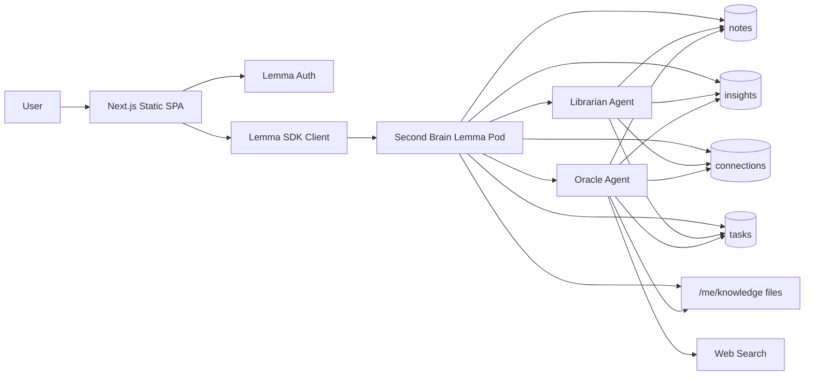
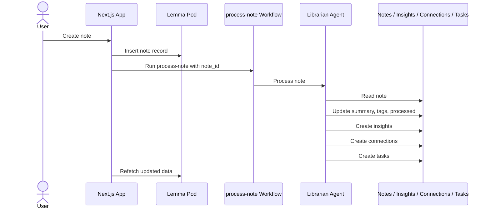
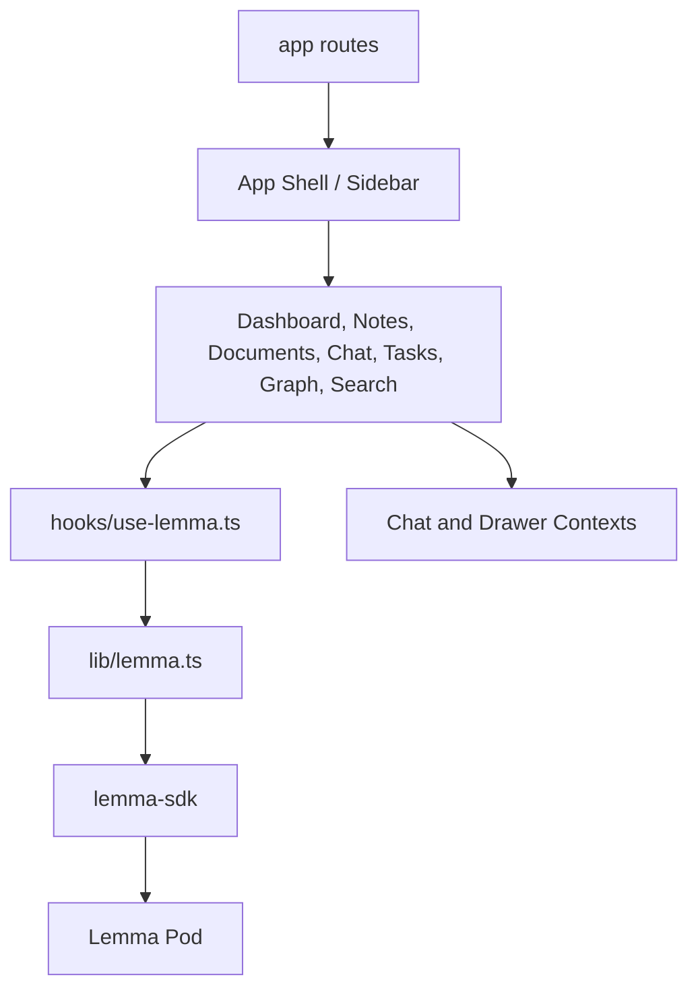

# Architecture

This document captures the main architecture views for Second Brain: system boundaries, note processing, data relationships, and frontend modules.

## System Architecture

## Note Processing Workflow

## Data Model

```mermaid
erDiagram
  notes ||--o{ insights : produces
  notes ||--o{ tasks : creates
  notes ||--o{ connections : source
  notes ||--o{ connections : target

  notes {
    uuid id
    text title
    text content
    enum type
    text source_url
    json tags
    text summary
    boolean processed
  }

  insights {
    uuid id
    text content
    enum type
    uuid note_id
    float confidence
  }

  connections {
    uuid id
    uuid source_id
    uuid target_id
    text relationship
    float strength
  }

  tasks {
    uuid id
    text title
    text description
    uuid note_id
    enum priority
    enum status
    date due_date
  }
```

## Frontend Modules

